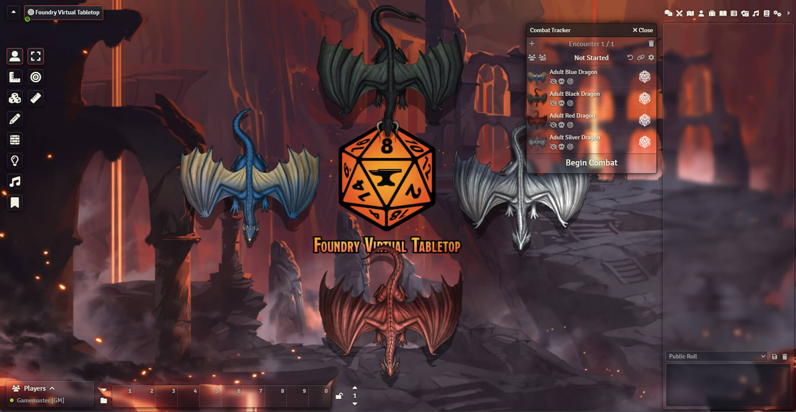
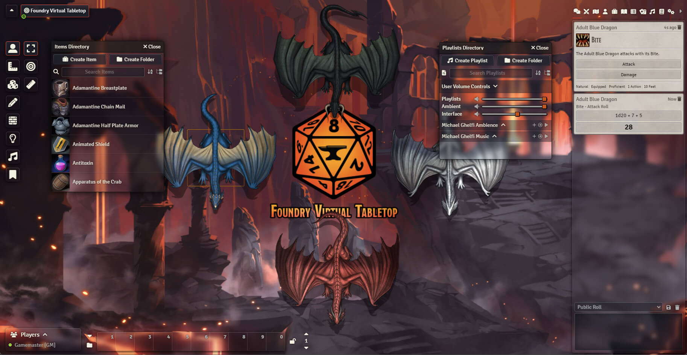

# Theme: Glass

A system agnostic (almost) theme for FoundryVTT.

Theme: Glass is a **very transparent** theme. This theme was, first and foremost, created for the "Theater of the Mind" kind of scenes.
With a less intrusive interface, highlight the background image of any scene and enhance your players' immersion with your superb illustrations.

Since it's very transparent, this theme is probably not suitable for newcomers. Once they have learned the basics of the vanilla interface, this shouldn't be a problem anymore.

### ⚠️ HELP! FoundryVTT is laggy

Theme: Glass makes extensive use of blurring effects. For this reason, certain scenes that are too complex (walls, lights, etc.) can become laggy. During the development phase, the Firefox browser was found to have a very poor handling of blur effects.
If this happens, you can disable blur effects while maintaining a transparent interface in the module settings.
Or better yet, use a Chronium based browser (brave, vivaldi, etc.)!

## Q&A

### Does it have to be so transparent?

Yes, that's the plan. It allows to emphasize the background image of a scene and increase immersion.
If, through feedbacks, I realize that the theme is too transparent for the majority of people, I may revise it.

### Why are some windows not transparent?

Some parts of the FoundryVTT interface are very dependent on the system used (character sheets, items sheet, chat cards, etc.).
Since Theme: Glass is system agnostic, it is not really an option to skin those. But most of the visible interface should be transparent for player accounts.

### FoundryVTT is laggy, why is that?

Probably because of the blur effects. Some browsers have a very poor handling of such effects.
If it becomes an issue, you can disable the blur effects in the settings of the module or you can use a Chronium based browser (brave, vivaldi, etc.).

### Is this module system agnostic?

It was created with this in mind, but some systems use their own theme. For these systems, the module is not compatible.

### And what about modules?

Depending on the work load, I can make certain modules compatible with this theme.

| Module name                                                                                 | Compatibility | Comment                                               |
| ------------------------------------------------------------------------------------------- | ------------- | ----------------------------------------------------- |
| [Dice Tray](https://gitlab.com/asacolips-projects/foundry-mods/foundry-vtt-dice-calculator) | ✅            | Styling overhaul , but hover colors are still vanilla |
| [GM Screen](https://github.com/ElfFriend-DnD/foundryvtt-gmScreen)                           | ✅            | Styling overhaul                                      |
| [SmallTime](https://github.com/unsoluble/smalltime)                                         | ✅            | Force opacity while resting                           |
| [Search and Highlight](https://github.com/Khaali-dev/fullsearch)                            | ✅            | Styling overhaul                                      |
| [FoundryVTT PF2e HUD](https://github.com/reonZ/pf2e-hud)                                    | ✅            | Partial support                                       |
